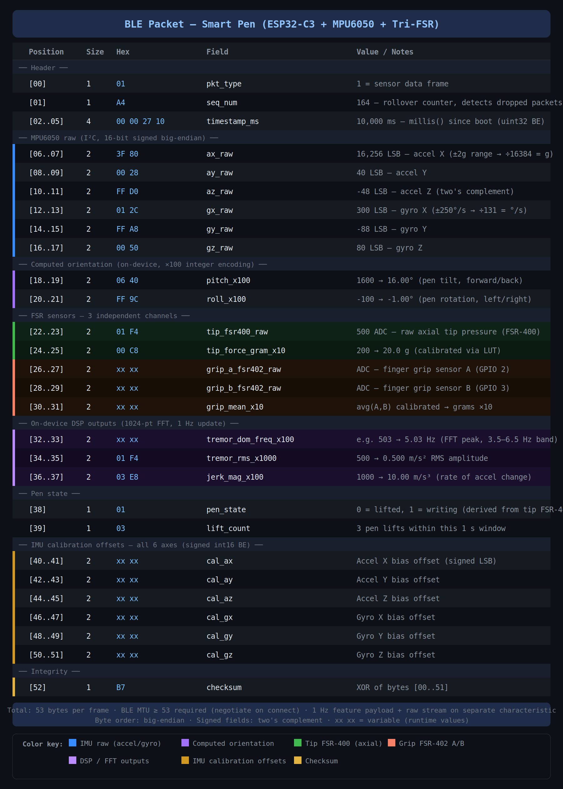

# Smart Pen — BLE Packet Specification

> **Device:** ESP32-C3 SuperMini  
> **Sensors:** MPU6050 (I²C) · FSR-400 (tip/axial) · FSR-402 × 2 (grip A & B)  
> **Packet type:** `0x01` — Sensor Data Frame  
> **Total size:** 53 bytes  
> **Transmission rate:** 1 Hz (feature vector) + optional raw stream on secondary characteristic  

---



---

## Overview

Each BLE notification from the smart pen carries a single 53-byte frame containing:

- A 6-byte **header** (packet type, sequence counter, timestamp)
- 12 bytes of **raw MPU6050 IMU data** (accelerometer + gyroscope, all 3 axes)
- 4 bytes of **computed orientation** (pitch and roll, ×100 integer encoding)
- 10 bytes from **3 independent FSR channels** (tip raw + calibrated, grip A raw, grip B raw, grip mean)
- 6 bytes of **on-device DSP outputs** (dominant tremor frequency, RMS amplitude, jerk magnitude)
- 2 bytes of **pen state** (writing/lifted flag, lift count)
- 12 bytes of **IMU calibration offsets** (all 6 axes)
- 1 byte **XOR checksum**

All multi-byte fields are **big-endian**. All signed fields use **two's complement**.

---

## Packet Layout

### Header

| Position | Size (B) | Field | Type | Example Hex | Interpreted Value |
|----------|----------|-------|------|-------------|-------------------|
| [00] | 1 | `pkt_type` | uint8 | `01` | 1 = sensor data frame |
| [01] | 1 | `seq_num` | uint8 | `A4` | 164 — rolls over at 255 |
| [02..05] | 4 | `timestamp_ms` | uint32 BE | `00 00 27 10` | 10,000 ms since boot |

**`seq_num`** increments with every transmitted packet. The mobile app uses gaps in this counter to detect dropped BLE notifications without requiring acknowledgement.

**`timestamp_ms`** is the raw output of `millis()` on the ESP32-C3. It resets to 0 on power cycle. The app must handle rollover (at ~49.7 days of continuous use).

---

### MPU6050 Raw IMU Data

> **Interface:** I²C, GPIO 8 (SDA) / GPIO 9 (SCL)  
> **Scale (accel):** ±2 g range → divide raw by 16,384 to get g  
> **Scale (gyro):** ±250 °/s range → divide raw by 131 to get °/s  

| Position | Size (B) | Field | Type | Example Hex | Interpreted Value |
|----------|----------|-------|------|-------------|-------------------|
| [06..07] | 2 | `ax_raw` | int16 BE | `3F 80` | 16,256 LSB |
| [08..09] | 2 | `ay_raw` | int16 BE | `00 28` | 40 LSB |
| [10..11] | 2 | `az_raw` | int16 BE | `FF D0` | -48 LSB |
| [12..13] | 2 | `gx_raw` | int16 BE | `01 2C` | 300 LSB |
| [14..15] | 2 | `gy_raw` | int16 BE | `FF A8` | -88 LSB |
| [16..17] | 2 | `gz_raw` | int16 BE | `00 50` | 80 LSB |

Raw values are transmitted without applying calibration offsets. The companion app (or post-processing pipeline) applies the `cal_a*` and `cal_g*` offsets from bytes [40..51] to produce corrected readings:

```
ax_corrected = ax_raw - cal_ax
gx_corrected = gx_raw - cal_gx
```

The pen's longitudinal axis is aligned with the **X axis**. Tremor analysis is primarily performed on `ax_raw` and `ay_raw`.

---

### Computed Orientation

> Calculated on-device from `ax_raw`/`ay_raw`/`az_raw` using a complementary filter.  
> Encoded as **integer × 100** to avoid floating-point in the BLE payload.  

| Position | Size (B) | Field | Type | Example Hex | Interpreted Value |
|----------|----------|-------|------|-------------|-------------------|
| [18..19] | 2 | `pitch_x100` | int16 BE | `06 40` | 1600 → **16.00°** (forward/back tilt) |
| [20..21] | 2 | `roll_x100` | int16 BE | `FF 9C` | -100 → **-1.00°** (left/right rotation) |

**Decoding:**
```python
pitch_deg = pitch_x100 / 100.0   # → 16.00°
roll_deg  = roll_x100  / 100.0   # → -1.00°
```

These values characterise pen grip posture and are used in the app to segment writing vs. resting tasks.

---

### FSR Sensor Channels

Three physically independent FSR channels are transmitted separately. This is the core innovation of the tri-FSR architecture — grip dynamics and axial writing pressure are **never conflated**.

#### Tip sensor — FSR-400 (axial writing pressure)

> **GPIO:** 1 · **Filter:** 100 kΩ series + 10 µF to GND (RC low-pass ~0.16 Hz cutoff for boot stability) + 100 nF primary filter  
> **Mechanism:** Internal plunger transfers only downward cartridge force — isolated from finger grip  

| Position | Size (B) | Field | Type | Example Hex | Interpreted Value |
|----------|----------|-------|------|-------------|-------------------|
| [22..23] | 2 | `tip_fsr400_raw` | uint16 BE | `01 F4` | 500 — raw 12-bit ADC count |
| [24..25] | 2 | `tip_force_gram_x10` | uint16 BE | `00 C8` | 200 → **20.0 g** (calibrated via LUT) |

`tip_fsr400_raw` is the direct ADC reading. `tip_force_gram_x10` is the same reading passed through a firmware calibration lookup table (LUT) to produce a physical force estimate in grams (×10 for one decimal place without floating-point).

`pen_state` at byte [38] is derived entirely from this channel: the pen is considered "writing" when `tip_fsr400_raw` exceeds a configurable threshold (default: 100 ADC counts).

#### Grip sensors — FSR-402 × 2 (fingerprint grip + micro-tremor)

> **GPIO A:** 2 · **GPIO B:** 3  
> **Filter:** 100 kΩ series + 10 µF (boot isolation) + 100 nF primary filter — same circuit as tip  
> **Placement:** Arrayed across the lower barrel fingerprint contact zone  

| Position | Size (B) | Field | Type | Example Hex | Interpreted Value |
|----------|----------|-------|------|-------------|-------------------|
| [26..27] | 2 | `grip_a_fsr402_raw` | uint16 BE | `xx xx` | ADC count — sensor A |
| [28..29] | 2 | `grip_b_fsr402_raw` | uint16 BE | `xx xx` | ADC count — sensor B |
| [30..31] | 2 | `grip_mean_x10` | uint16 BE | `xx xx` | avg(A, B) → grams ×10 |

Both raw channels are transmitted independently so the app can detect asymmetric grip (e.g., one-finger tremor vs. whole-hand rigidity). `grip_mean_x10` is the firmware-averaged and calibrated combined reading for direct clinical use.

High-frequency variance on `grip_a_fsr402_raw` and `grip_b_fsr402_raw` within each 1 s FFT window encodes the **micro-tremor (pill-rolling) signal** captured by the FSR-402 array.

---

### On-Device DSP Outputs

> Computed on the ESP32-C3 from a 1024-sample window (1.024 s at 1 kHz sampling rate).  
> Band-pass filter: 3.5–6.5 Hz Butterworth IIR applied before FFT.  
> Updated once per second.  

| Position | Size (B) | Field | Type | Example Hex | Interpreted Value |
|----------|----------|-------|------|-------------|-------------------|
| [32..33] | 2 | `tremor_dom_freq_x100` | uint16 BE | `xx xx` | e.g. 503 → **5.03 Hz** (FFT spectral peak) |
| [34..35] | 2 | `tremor_rms_x1000` | uint16 BE | `01 F4` | 500 → **0.500 m/s²** RMS amplitude |
| [36..37] | 2 | `jerk_mag_x100` | uint16 BE | `03 E8` | 1000 → **10.00 m/s³** |

**`tremor_dom_freq_x100`** is the frequency bin with peak power in the 3.5–6.5 Hz band. Parkinsonian resting tremor typically falls in the 4–6 Hz range. Encode: `freq_hz × 100` as uint16.

**`tremor_rms_x1000`** is the RMS acceleration amplitude computed over the band-pass filtered signal in the current window. This is the primary clinical "shakiness index" for real-time monitoring.

**`jerk_mag_x100`** is the magnitude of the jerk vector (time-derivative of acceleration). Elevated jerk is associated with abrupt, irregular movements characteristic of bradykinesia and dyskinesia, and complements the tremor frequency metric.

**Decoding:**
```python
freq_hz    = tremor_dom_freq_x100 / 100.0   # → 5.03 Hz
rms_mss    = tremor_rms_x1000     / 1000.0  # → 0.500 m/s²
jerk_mss3  = jerk_mag_x100        / 100.0   # → 10.00 m/s³
```

---

### Pen State

| Position | Size (B) | Field | Type | Example Hex | Interpreted Value |
|----------|----------|-------|------|-------------|-------------------|
| [38] | 1 | `pen_state` | uint8 | `01` | 0 = lifted, 1 = writing |
| [39] | 1 | `lift_count` | uint8 | `03` | 3 pen lifts in current window |

`pen_state` is a binary flag derived from `tip_fsr400_raw`. It transitions `0 → 1` when tip pressure exceeds the threshold and `1 → 0` when it drops below it (with a 50 ms debounce).

`lift_count` counts the number of `1 → 0` transitions (pen lifts) within the current 1-second window. A high lift count alongside low `tremor_rms` may indicate hesitation or freezing of gait rather than tremor.

---

### IMU Calibration Offsets

> Stored in firmware after a calibration routine (device held stationary on a flat surface for 5 s).  
> Transmitted in every packet for post-processing validation and offset drift monitoring.  
> **All 6 axes** are included — do not apply these to `ax_raw`/`gx_raw` in the embedded firmware; they are applied in the app layer.

| Position | Size (B) | Field | Type | Notes |
|----------|----------|-------|------|-------|
| [40..41] | 2 | `cal_ax` | int16 BE | Accel X static bias |
| [42..43] | 2 | `cal_ay` | int16 BE | Accel Y static bias |
| [44..45] | 2 | `cal_az` | int16 BE | Accel Z static bias |
| [46..47] | 2 | `cal_gx` | int16 BE | Gyro X static bias |
| [48..49] | 2 | `cal_gy` | int16 BE | Gyro Y static bias |
| [50..51] | 2 | `cal_gz` | int16 BE | Gyro Z static bias |

---

### Integrity

| Position | Size (B) | Field | Type | Example Hex | Notes |
|----------|----------|-------|------|-------------|-------|
| [52] | 1 | `checksum` | uint8 | `B7` | XOR of all bytes [00..51] |

**Computing the checksum (firmware):**
```c
uint8_t checksum = 0;
for (int i = 0; i < 52; i++) checksum ^= buf[i];
buf[52] = checksum;
```

**Validating on the app:**
```python
xor = 0
for b in packet[:52]:
    xor ^= b
valid = (xor == packet[52])
```

---

## Full Packet Summary

| Bytes | Section | Size |
|-------|---------|------|
| [00..05] | Header | 6 B |
| [06..17] | MPU6050 raw (accel + gyro) | 12 B |
| [18..21] | Computed orientation | 4 B |
| [22..31] | FSR tri-sensor channels | 10 B |
| [32..37] | DSP outputs (FFT + RMS + jerk) | 6 B |
| [38..39] | Pen state | 2 B |
| [40..51] | IMU calibration offsets | 12 B |
| [52] | Checksum | 1 B |
| **Total** | | **53 B** |

---

## BLE Configuration

| Parameter | Value |
|-----------|-------|
| Service UUID | `0xFFE0` (custom) |
| Feature vector characteristic | `0xFFE1` — notify, 1 Hz |
| Raw stream characteristic | `0xFFE2` — notify, downsampled |
| MTU | Negotiate ≥ 53 bytes on connect |
| Connection interval | 20 ms (requested) |
| TX power | 0 dBm (default ESP32-C3) |
| Range (tested) | 3 m, 0 packet loss at 1 Hz |

The feature vector (this packet) is transmitted at **1 Hz** on characteristic `0xFFE1`. A separate raw downsampled waveform for live graph rendering is transmitted on `0xFFE2` and is not covered by this document.

---

## GPIO Pin Mapping

| Sensor | GPIO | Interface | Filter |
|--------|------|-----------|--------|
| FSR-400 (tip) | GPIO 1 | ADC (ADC1) | 100 kΩ + 10 µF + 100 nF |
| FSR-402 A (grip) | GPIO 2 | ADC (ADC1) | 100 kΩ + 10 µF + 100 nF |
| FSR-402 B (grip) | GPIO 3 | ADC (ADC1) | 100 kΩ + 10 µF + 100 nF |
| MPU6050 SDA | GPIO 8 | I²C | — |
| MPU6050 SCL | GPIO 9 | I²C | — |

> **Note on boot-safe filter:** GPIOs 1–3 on the ESP32-C3 are bootstrapping pins. The 100 kΩ series resistor combined with the 10 µF capacitor forms a secondary RC filter (~0.16 Hz cutoff) that holds these pins at a stable high-impedance level during power-on sequencing, preventing spurious ADC readings from being logged before the firmware initialises.

---

## Removed Fields (vs. Original Packet)

The following fields from the original packet design were removed to align the specification with the actual hardware:

| Removed Field | Reason |
|---------------|--------|
| `altitude_x100` | Requires barometric sensor (BMP388/LPS22HB). Not present in hardware — MPU6050 has no barometer. |
| `tremor_x1000` (single scalar) | Ambiguous — split into `tremor_dom_freq_x100` (FFT peak Hz) and `tremor_rms_x1000` (amplitude) for clinical clarity. |
| `pressure_raw` + `force_gram_x10` (as sole FSR fields) | Renamed and expanded: all three FSR channels now have independent fields. Grip sensors A and B are no longer collapsed into a single value. |
| `cal_ax` + `cal_gx` only | Extended to all 6 axes (ax/ay/az/gx/gy/gz). |

---

## Disclaimer

This packet specification describes a **research prototype** for Parkinson's disease tremor *screening and monitoring* only. It is not a certified medical device. All clinical interpretations of transmitted data must be performed by qualified healthcare professionals.

---

*Generated: 2026-06-24 · Smart Pen v1.0 · ESP32-C3 SuperMini firmware*
